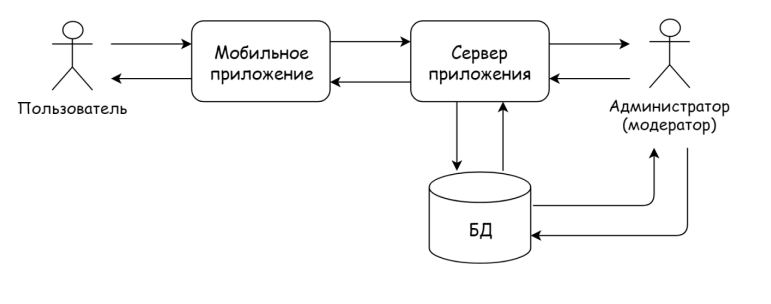
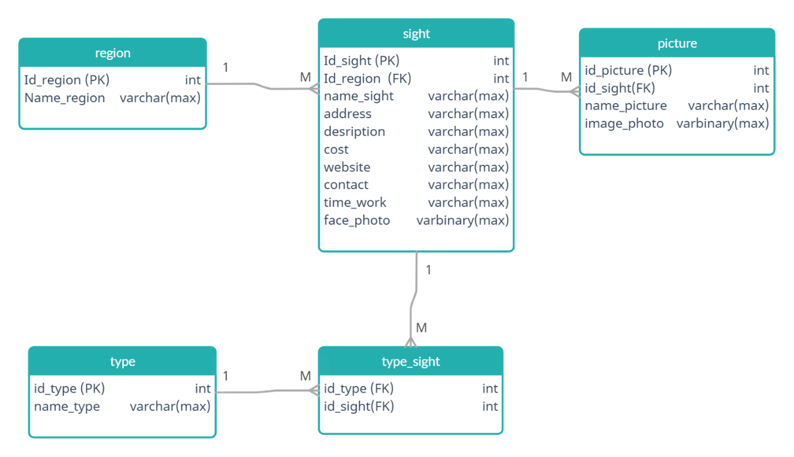

# Lazy Guide
## **Mobile application for tourism in the Russian Federation.** 
>Ключевыми целями в процессе написания бакалаврской работы было создание полнофункционального работоспособного мобильного приложения, для этого производился анализ предметной области, выбор наиболее походящих средств разработки, а также реализация удобного для большинства пользователей интерфейса. 

## **Средства разраотки**
 

|    Область    | Инструмент| 
| ------------- |:------------------:| 
|IDE для клиента                     | Android Studio 4.0  |    
|Язык программирования для клиента   | Kotlin 1.5          |  
|СУБД                                |   Microsoft SQL Server 18.9 |  
|Платформа веб-сервера               | Node.js 16.2        | 
|Язык программирования веб-сервера   |TypeScript 4.3.1            |
 

## **Структурная модель системы**
>Модель структуры системы представлена контекстной диаграммой,на которой показано работа пользователей с элементами программного продукта. 

 

  

>*Пользователь*, работая с клиентской частью осуществляет ряд выборов (такие как выбор региона, достопримечательности или построение маршрута), тем временем сервер приложения обрабатывает данные запросы, взаимодействуя с БД и возвращая мобильному приложения необходимые данные. Взаимодействие с серверами Google maps необходимо для работы с картами, построения маршрута и определения местоположения. 
*Администратор(модератор)* приложения не имеет в распоряжении заточенной под его нужды панели взаимодействия с мобильным приложением или уникальной системы. Подразумевается, что он обладает достаточным опытом и квалификацией для поддержки кода на уровне серверной части и БД

## **Структура базы данных**
>Разработанная БД программного продукта «Lazy Guide» представлена в формате ERD 
 

  

>База данных состоит из 5 сущностей.
1. Таблица *region* хранит информацию о регионах РФ.
2. Таблица *sight* хранит информацию о достопримечательностях.
3. Таблица *picture*  хранит изображения достопримечательностей для реализации галереи.
4. Таблицы *type* и *type_sight* необходимы для систематизирования достопримечательностей по их типам

## **Пользовательские интерфейсы**
### 1. Загрузочный экран(splash screen):
>Данный интерфейс является необходимым,тк Android-приложениям требуется некоторое количество времени для запуска.Чтобы пользователи не смотрели на пустой экран, мы выводим наш логотип.

  

### 2. Выбор региона:
> Дальше у нас представлен раздел выбора интересующего региона, на экране отображена возможность поиска по названию или его части.После осуществлении выбора субъекта РФ, приложение открывает список достопримечательностей данного региона.

  

### 3. Обрантная связь:
> Также из раздела «Выбора региона» можно перейти в раздел «Обратной связи», что представлено на данном анимированном изображении. Здесь пользователю предоставляется возможность заполнить необходимые поля, чтобы предложить свою собственную достопримечательность.Эти данные отправляются на почту администратора-модератора для дальнейшего изучения.

  

### 4. Список достопримечательностей и Подробная информация:
> Представляем взаимодействие с разделом «Список достопримечательностей» выбранного региона, мы можем наблюдать, что его  можно сортировать по типу.Также после выбора определенной достопримечательности, мы переходим на раздел "подробной информации" о ней! 
>  Тут у нас представлено описание, галерея изображений, адрес, время работы и прочая информация. 

  

### 5. Путиводитель:
> На последнем анимированном изображении мы наблюдаем переход из раздела «Подробной информации» в раздел «Полномасштабной карты». В нем строится маршрут от текущего местоположения пользователя до расположения достопримечательности

  

## **Итоги**

>Создание мобильного приложения для поддержки внутреннего туризма может повысить интерес жителей Российской Федерации к изучению достопримечательностей родной страны. Приложение позволяет не только узнавать новое, но и продвигать собственные малоизвестные достопримечательности. 
В будущем приложение может быть улучшено и доработано.

 